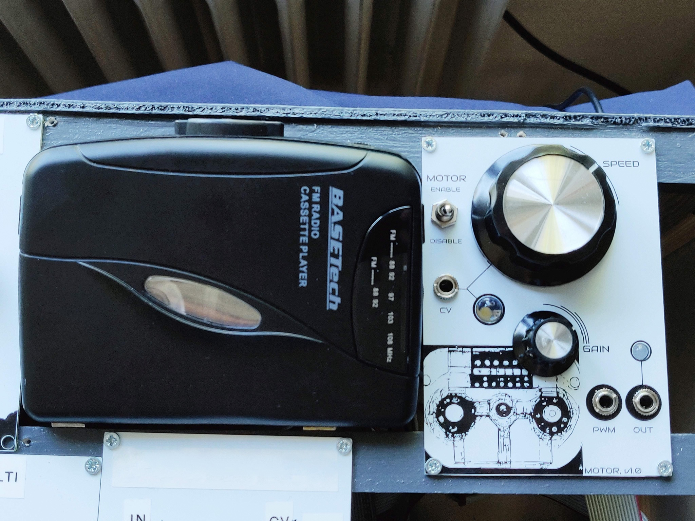
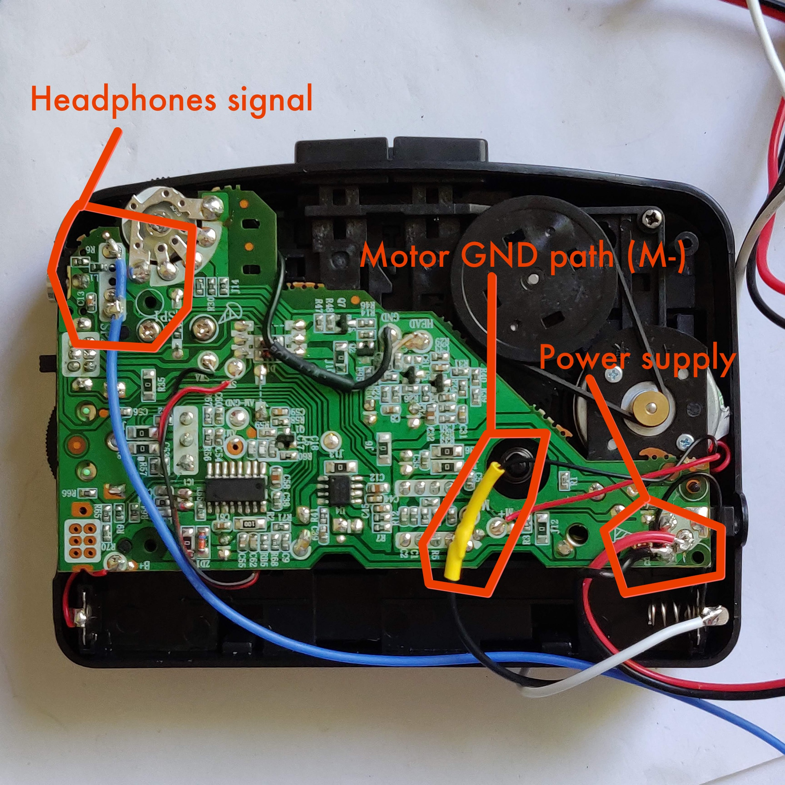

# Walkman Motor - A Walkman bridge to Eurorack

## Overview

This repo contains code, assets and hardware description files (schematic and PCB gerber) for a eurorack compatible module which is intended to control the motor speed of a modified walkman. It also does signal conditioning to bring the headphone out levels of the walkman to eurorack levels (~10Vpp).

The intended use is to combine the world of tape loops and modified walkmans with the modular synthesizer universe. See picture below.

[Schematics](easyEDA-files/Schematic_WalkmanMotorModule_2022-08-23.pdf)

## Status of this repo, 23-AUG-2022

- Revision 1 of this board has been ordered, built, fixed/patched and verified to work
- The fixes have been incorporated in the included *rev 2* of the schematic and gerber files, but they have not been validated (as I have a working version now). It should work, as the fixes were trivial in nature in the end. Famous last words I guess.
- The Arduino code is identical to what has been verified to work.

## Build notes

- *IMPORTANT!* - The Power supply to power the walkman must be different from the internal modular synth supply. Use a regular 9V DC brick. Anything between 6-12V DC should work. I used a 9V DC supply.
- Walkman: BaseTECH KW-118C (very easy to modify!), but any walkman should do.
- Points to modify and hook up to the PCB from the Walkman: Power supply to the walkman, headphone out and finally the negative side of the drive motor in the walkman.

## Principle of operation

There are three blocks in the circuit - Controller, Motor driver and Amplifier.

_The Controller_ takes care of reading CV and mapping that to motor speed PWM. Current speed is indicated via an LED.

_The Motor driver_ takes the signal from the controller and drives the motor. It also takes the headphone out signal from the walkman and feeds it to the Amplifier. The motor driver operates on its own power and is galvanically separated from the rest of the circuit.

_The Amplifier_ conditions the returned signal and amplifies it from headphone to eurorack voltage levels.

### More detail

An Arduino Nano reads CV voltage and speed knob postion and converts that to a PWM signal to drive the motor. The signal is fed to an optocoupler which in turn drives the walkman motor via a TIP 120 transistor. This way, driving the motor is galvanically separated from the eurorack supply.

The headphone output of the walkman is fed back to the circuit from the driver to the amplifier via an 1:1 audio isolation transformer. This ensures galvanic separation of the audio path. As the walkman operates on its own supply, there is no common ground reference that can be used.

The final amplification stage applifes a lowpass filter at around 16KHz to get rid of occational spikes observed during testing. It then amplifies the signal to eurorack levels. The gain is set by the user via a knob.

## Credits

The faceplate arwork was developed in collaboration with the Midjourney bot.

## Known issues

- The clip indicator LED on the output does not work. It is a legacy feature and will be removed.
- Driving the walkman on 3.3V is technically correct, as it is a 3V device, but it seems to be too weak. The motor easily stalls. Experiment with the settings in the Arduino sketch to tune the range. It is probably worth trying to drive the motor on 5V instead of 3.3V to get more torque.
- The speed indicatio LED is too small (100R) for the 8mm brigh white LED. It has been compensate for in the code, but at the cost of only having 32 levels of brightness. It is worth increasing the resistor value and re-tuning the code to fit.

